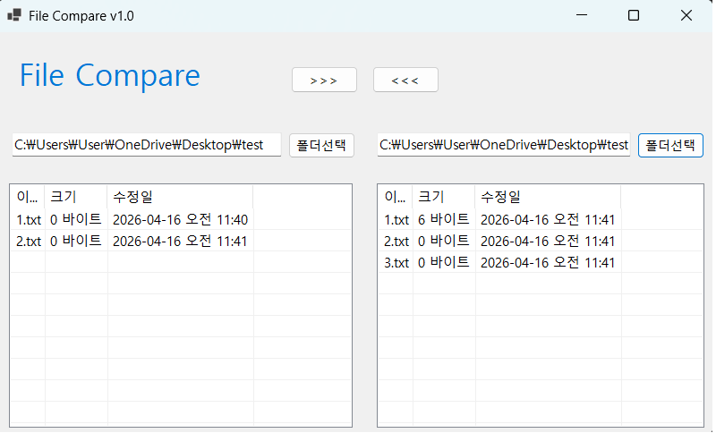

# (C# 코딩) 파일 비교 프로그램
## 개요
- C# 프로그래밍 학습
- 1줄 소개: 두개의 폴더를 선택해 폴더 내의 파일들을 비교하는 프로그램
- 사용한 플랫폼:
	- C#, .NET Windows Forms, Visual Studio, GitHub
- 사용한 컨트롤:
	- Label, TextBox, SplitContainer, Button, Panel, ListView
## 실행 화면 (과제1)
- 1단계 코드의 실행 스크린샷

- 구현한 내용 (위 그림 참조)
	- UI 설계 : 앱에서 사용할 기본적인 UI를 설계하고 추가
	- 폴더선택 버튼 : 폴더선택 버튼을 눌러 폴더를 고르고, 해당 폴더가 TextBox에 표시되도록 기능 추가
	- ListView 업데이트 : 선택한 폴더의 내용을 ListView에 표시하도록 기능 추가
## 실행 화면 (과제2)
- 2단계 코드의 실행 스크린샷
(여기에 이미지 삽입)
## 실행 화면 (과제3)
- 3단계 코드의 실행 스크린샷
(여기에 이미지 삽입)
## 실행 화면 (과제4)
- 4단계 코드의 실행 스크린샷
(여기에 이미지 삽입)
